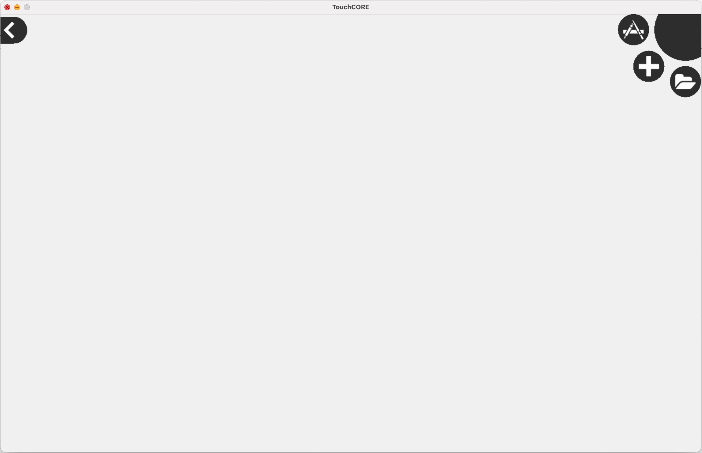
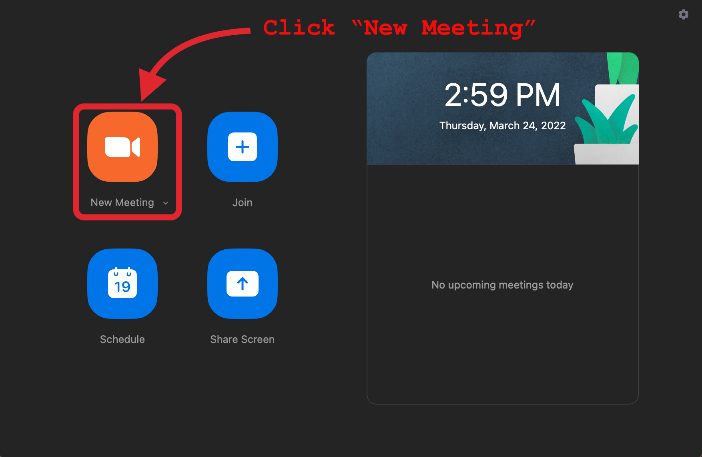
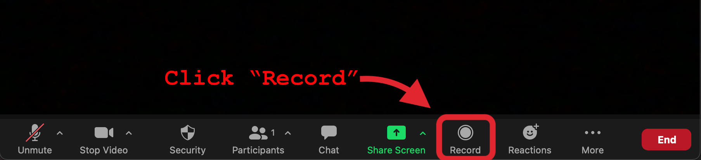

# Preliminaries

## Software

Let's first check that you have all required software installed on your machine.

 > If you are not able to install the required software, you can still participate in the study. Please [contact the P.I.](mailto:maximilian.schiedermeier@mcgill.ca) to schedule access to a lab computer.

### Java

You will need Java, version ```11.0.5```. Unfortunately it has to be **exactly** this version for compatibility with TouchCORE.

 * Verify your java version with ```java -version```
 * If the output is **not exactly 11.0.5**, install it:

=== "Mac OS"
     * Download the [JDK 11.0.5 MacOS package](https://www.cs.mcgill.ca/~mschie3/1105/OpenJDK11U-jdk_x64_mac_hotspot_11.0.5_10.pkg).
     * Double click the downloaded ```.pkg``` file.
     * Follow the install instructions.

=== "Linux"
     * Download the [JDK 11.0.5 Linux package](https://www.cs.mcgill.ca/~mschie3/1105/OpenJDK11U-jdk_x64_linux_hotspot_11.0.5_10.tar.gz).
     * Extract the file: ```tar xvf *.tar.gz```
     * [Add the contained commands to your path](https://docs.oracle.com/cd/E19062-01/sun.mgmt.ctr36/819-5418/gaznb/index.html).

=== "Windows"
     * Download the JDK 11.0.5 [MSI](https://www.cs.mcgill.ca/~mschie3/1105/OpenJDK11U-jdk_x64_windows_hotspot_11.0.5_10.msi) or [ZIP](https://www.cs.mcgill.ca/~mschie3/1105/OpenJDK11U-jdk_x64_windows_hotspot_11.0.5_10.zip) installer.
     * Double click the downloaded file.
     * Follow the install instructions.

 > **After installation**, verify that **11.0.5 is now the default installed version**.  
Type again: ```java -version```, check the output.

### Maven

You will need the java build tool *Maven*.

 * Test if your system has the ```mvn``` command.
 * If missing, install it:

=== "Mac OS"
     * Unless already installed, [get the ```brew``` package manager](https://brew.sh/).
     * Install maven:  
    ```brew install maven```

=== "Linux"
     * Use the ```apt``` package manager to install maven:  
    ```sudo apt install maven```

=== "Windows"
     * Download the [graphical install wizard](https://maven.apache.org/download.cgi).
     * Double click it and follow the instructions.

### TouchCORE

You need a special TouchCORE release, built for this study. Older TouchCORE versions are not compatible.

 * Download the study release here: [TouchCORE (RESTify Study / JAR)](https://www.cs.mcgill.ca/~mschie3/touchcorestudyrelease/touchcore-study-release.zip)
 * Extract the downloaded zip file.

 > You **can not** use an older version of TouchCORE. The required features are only contained in the above version.

 * Verify you can start it:

=== "Intel/AMD CPU"
     ```java -jar TouchCORE.jar```

=== "Apple M1 CPU"
     ```softwareupdate --install-rosetta``` (only first time)  
     ```java -jar TouchCORE.jar```

You should see this:  


 > Should the TouchCORE window does not fit your screen, or should you wish to adjust the window dimensions, edit the file ```Settings.txt``` (in the TouchCORE directory) and adjust the lines: ```DisplayWidth=...``` and ```DisplayHeight=...```. Fullscreen mode on M1-Macs is not reliable, do not use it if you have an M1-Mac.

### IntelliJ

Any IDE can be used, but we strongly recommend IntelliJ. Also further instructions and guides on this page are exclusively for IntelliJ.

 * [Download and install IntelliJ](https://www.jetbrains.com/idea/download/).
    * The *community* version is sufficient.
    * If desired you can also use the *ultimate* version (registration with mcgill email required).

### Zoom

You'll need zoom, to record your task activity. (*)

 > (*) You can use whatever software you want, as long as it captures your entire screen for the full duration of your task activity. We only recommend zoom for REB compliance reasons. E.g. on Mac there is the preinstalled software "Quicktime".

 * No worries you can stay offline, Zoom is only required to record your screen to disk.
 * Unless already installed, [install zoom](https://zoom.us/download) now.
 * Then try to record a short screencast, to test your setup:
    * Start a new meeting.  
    
    * Click the record button.  
    
    * Start to share your Desktop.  
    
    * Wait some seconds.
    * End the zoom meeting

> **Verify that your *Desktop* recording to file worked. Watch your test recording now!**

## Applications

This section describes how to obtain source code and prepared TouchCORE models for the study objects.

### Source Code

For the upcoming two tasks you will need prepared source code to work on.  

 * Prepare a dedicated folder for your tasks, e.g. on your Desktop.
 * Clone these three repositories, but do not yet inspect their content:
    * [The Zoo](https://github.com/kartoffelquadrat/Zoo):  
```git clone https://github.com/kartoffelquadrat/Zoo.git```
    * [The Book Store](https://github.com/kartoffelquadrat/BookStoreInternals):  
```git clone https://github.com/kartoffelquadrat/BookStoreInternals.git```
    * [Tic Tac Toe](https://github.com/kartoffelquadrat/XoxInternals):  
```git clone https://github.com/kartoffelquadrat/XoxInternals.git```
 * You should now have three new directories in your study folder:
 * Finally, **for each** folder, verify you can build the code as is:
    * Open a terminal / command line in the project folder.
    * Run: ```mvn clean install```
    * Verify there are no error messages printed to screen.

### Prepared Models

Throughout your tasks you will be working with the below TouchCORE model.

 * Download [the model bundle](https://www.cs.mcgill.ca/~mschie3/studymodels/studymodels.zip).
 * Extract them all on your disk.
 * **Do not yet open them** with TouchCORE.

## Task Illustration

In both of your tasks you will convert an existing java application to a RESTful service. This activity is also called *RESTify* or *RESTification*.  

 * A REST application is a service that exposes functionality over a a network protocol:
    * The service creates the illusion of offering all functionality through CRUD operations on resources.  
This is a bit like file system access where you can **C**reate, **R**ead, **U**pdate or **D**elete files.  
However, access is not through a file system, but though the HTTP protocol.
    * A resource is identified by its URL (*Unique Resource Location). It looks e.g. like this:  
```http://127.0.0.1:8080/zoo/animals```
       * ```http``` specifies the protocol to reach this resource
       * ```127.0.0.1:8080``` sets physical location of the target machine and the port running the REST service.
       * ```zoo/animals``` is the location of a resource, offered by the running REST service.
    * A REST interface is always an abstraction of the actual implementation, and should not be confused with RMI (*Remote Method Invocation*) where existing methods are called as-they-are over network.
 * At the start of each task I will provide you with the tools for this process and illustrate the requests activity on a sample application, the **Zoo**.

### The Zoo Application

The Zoo is a minimal java desktop application that offers some demo functionality, namely:

 * Looking up the Zoo's opening hours.
 * Looking up all names of Zoo animals.
 * Looking up details for a specific animal, identified by name.
 * Adding a new animal to the Zoo.

The above functionality is all provided by a singleton class: [```Zoo```](https://kartoffelquadrat.github.io/Zoo/eu/kartoffelquadrat/zoo/Zoo.html).  

 * For convenience, here is a class diagram of the ```Zoo``` class:  

 * You can also inspect the [DesktopLauncher](https://github.com/kartoffelquadrat/Zoo/blob/master/src/main/java/eu/kartoffelquadrat/zoo/DesktopLauncher.java), to see how to invoke above methods.
 * Finally you can also run the provided Zoo implementation as is, to see a demo of above functionality:
    * Open a terminal in your cloned Zoo project
    * Type: ```mvn clean package exec:java```

### The Zoo REST interface description

The RESTification of an application (e.g. the Zoo) requires an interface description. An interface description tells you:

 * The expected arrangement of REST resources, and also their individual locations.
 * Which methods (```Get```, ```Put```, ```Post```, ```Delete```) are supported per resource.
 * What happens when a REST resource  method was called, and how required parameters are provided.

For example for the Zoo the interface description could look like this:  

