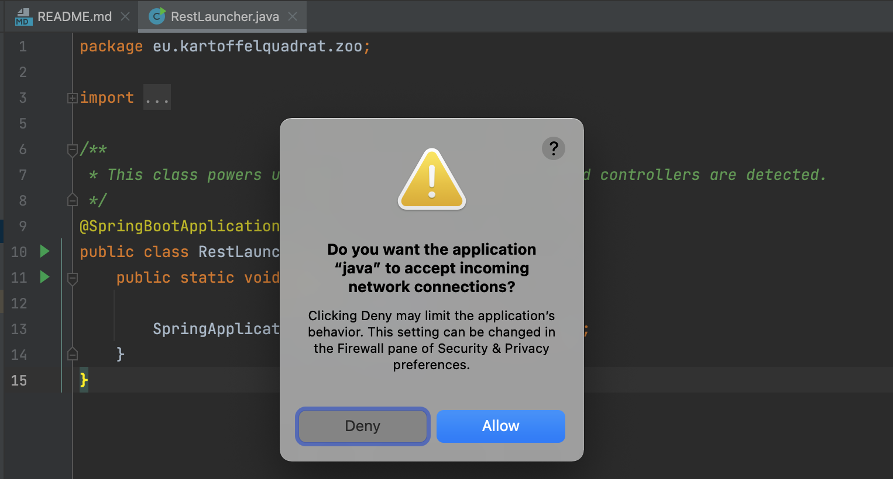

# Task 1
Your **first** task is the **manual** conversion of **Tic Tac Toe** into a RESTful service.

 > **WARNING!** Start your screen recording **now**. Your entire task actvity must be captured. This includes your familiarization with the task description!

## Task Illustration (Restifying the Zoo)


I will now illustrate the steps of a **manual** conversion to a RESTful service on the example of the Zoo.  
I will use the previously shown [Zoo REST interface description](interface-zoo.txt).

 * Please watch [this short screencast](https://www.cs.mcgill.ca/~mschie3/restifyvideos/IntelliJ-1080p.mp4) where I demonstrate and explain the required code changes.
 * Below you additionally find a recapitulation of the main steps.
 * Additionally you can conveniently inspect both versions and the changes made:
    * Switch to *Desktop Zoo* version: ```git checkout master``` or [inspect code online](https://github.com/kartoffelquadrat/Zoo/tree/master/src/main/java/eu/kartoffelquadrat/zoo).
    * Switch to *RESTified Zoo* version: ```git checkout RESTified``` or [inspect code online](https://github.com/kartoffelquadrat/Zoo/tree/RESTified/src/main/java/eu/kartoffelquadrat/zoo).
    * Compare versions: ```git diff master..RESTified``` or [inspect changes online](https://github.com/kartoffelquadrat/Zoo/commit/8fe7675b65f795897910358ed089ea2a0e22aeff).

### Project Layout Overview

### Build Configuration Changes

 > Want to see all Zoo-RESTify ```pom.xml``` changes at a glance? Run ```git diff master..RESTified pom.xml```. Green lines were added for RESTification, red lines were removed.

#### Build and Run

These instructions are to build and run from command line. While developing in IntelliJ you can safly use the "green triangle button" next to your new spring launcher class.  


The first time you start your REST application you might see a warning about incoming connections. Select "*Allow*".
  

  * Build a self contained executable jar file: ```mvn clean package```
  * Run the jar file: ```java -jar target/zoorestified.jar```  
```zoorestified``` is the name you provided as ```finalName``` in your ```pom.xml```.

### Java Code Changes

 > Want to see all Zoo-RESTify ```java``` changes at a glance? Run ```git diff master..RESTified *java```. Green lines were added for RESTification, red lines were removed.

#### Launcher

#### Beans and Singletons

#### Resource Mapping with Annotations

### Compile / Run / Verify (possibly master template)

### Compile and Test

To compile and test your produced REST service:

 * Compile your project with: ```mvn clean package```
 * Open the newly generated ```target``` folder.
 * Run the generated JAR file with: ```java -jar YOUR-SERVICE-NAME.jar```
 * Test access with your browser. You can directly access any *[GET]* resource by typing this into the URL bar:  
```http://127.0.0.1:8080/zoo/animals```  
*(where ```zoo/animals``` is replaced by a valid GET-enabled resource of your application)*

## Your Task

Now it is your turn! 

### Instructions

 * All you need to do is replicate the above steps for the requested app.
 * Limits:
    * You may stop whenever you deem the task successfully completed.
    * You may also stop after 45 Minutes of refactoring, whatever the state of your refactoring - You are however allowed to continue as long as you want.
 * The target REST interface description for your task is below.
 * Please now run a
**manual** conversion of **Tic Tac Toe** into a RESTful service.
### Legacy Application Details

Below diagram highlights classes and methods of the [legacy Tic Tac Toe application](https://github.com/kartoffelquadrat/XoxInternals), relevant to your RESTification task. For more information on theses methods, also consult the [Tic Tac Toe online documentation](https://kartoffelquadrat.github.io/XoxInternals/eu/kartoffelquadrat/xoxinternals/package-summary.html).  


### Interface Description: Tic Tac Toe Resources and Methods

 * Your interface should begin with a top-level resource "*xox*", offering two methods.
    * A *[GET]* request to the "*xox*" resource should result in a lookup of all currently running games, as a list of game-identifiers.
    * A *[POST]* request to the "*xox*" resource should allow adding of a new game instance. The identifier is generated on server side and does not need to be provided, however the request body should provide all parameters required as game settings.
 * The "*xox*" resource should possess a dynamic placeholder subresource, representing individual game instances by identifier.
    * A *[GET]* request on the identifier placeholder resource should retrieve scoring information for the targeted game.
    * A *[DELETE]* request on the identifier placeholder resource should remove the game from the list of all games.
 * The dynamic resource representing games by their identifier should have two subresources: "*players*" and "*board*".
    * A *[GET]* request on the "*board*" resource should return a list of player names involved into the specified game. The game instance is in this case provided by value of the parent placeholder resource.
    * A *[GET]* request on the "*board*" resource should return a snapshot of the current game board layout, is to say which cells empty or occupied by a given player. The game instance is in this case provided by value of the parent placeholder resource.
 * The "*player*" resource should possess a dynamic placeholder resource, encoding the name of a given player. This resource has no methods, but in its turn a subresource "*actions*".
    * A *[GET]* request on actions should return an array of possible actions for a given player in a given game. Each action represents the claim of an available field. The required player  name is provided by the parent dynamic resource representing a player name and the game instance is provided by the value of the dynamic sub resource of the root resource.
 * The "*actions*" resource should possess a dynamic placeholder resource that serves to identify the a specific selection of the actions available to a given player in a given game.
    * A *[POST]* request on that dynamic placeholder resource should allow the selection of a given action, to perform it. The precise action is then identified by an int value taken by the dynamic resource, representing the position in the array of all possible actions. The required player  name is provided by the parent dynamic resource representing a player name and the game instance is provided by the value of the dynamic sub resource of the root resource.
    
 > Click <a href="../interface-xox.txt" download>here to download interface description</a> as file.
