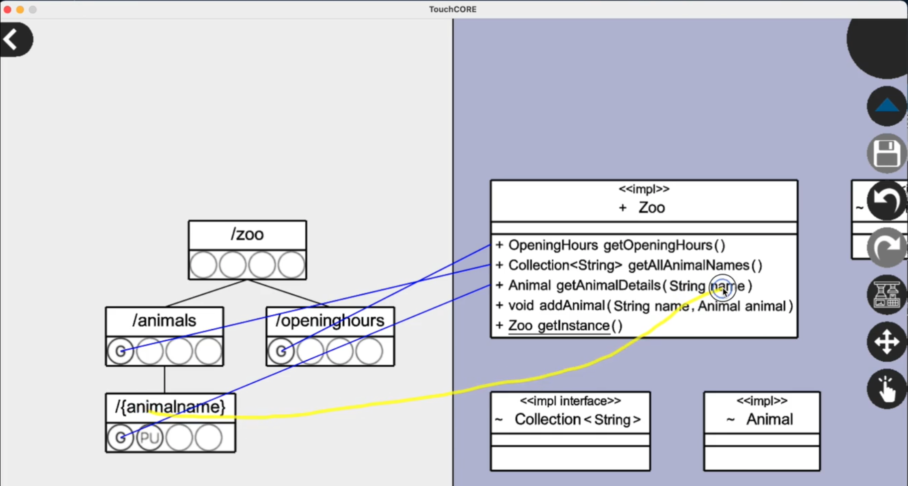

# Task 2
Your **second** task is the **TouchCORE assisted** conversion of the **Book Store** into a RESTful service.

 > **WARNING!** Start your **screen recording** now. Your entire on-screen task activity must be captured. This includes your familiarization with the task description!

## Task Illustration (Restifying the Zoo)


I will now illustrate the steps of a **TouchCORE assisted** conversion to a RESTful service on the example of the Zoo.  
I will use the previously shown [Zoo REST interface description](interface-zoo.txt).

 > Afterwards, your task will be to apply the same *TouchCORE assisted* methodology on a **different** application. Your task is **not** to replicate the Zoo conversion while you are watching.

 * Please now watch [this screencast](../../../restifyvideos/TouchCORE-1080p.mp4) where I demonstrate and explain TouchCORE usage.
    * Below you then find a summary of the main steps.
    * If anything does not work as expected, take a look at the [Troubleshoot section](#troubleshoot).

### Load TouchCORE Project

 * Locate the TouchCORE release folder
 * Launch TouchCORE: ```java -jar TouchCORE.jar```
 * Load the prepared Zoo model:
    * Click the *folder* icon.  

 * Navigate to the provided *Class Diagram*
    * Tap and hold the "Zoo" box  

    * Select "*Open Realization Model*"
    * Inspect the *Class Diagram* (Business Logic)  


### Draw ResTL Model

 * Use the Navigation bar to leave the *Class Diagram*  

 * Open the "ResTL" perspective:
    * Tap and hold the "Zoo" box  

    * Select "*Open Realization Model*"
    * Open the "Exposed Interface" model
 * Modify the *ResTL* model according to the provided *Interface Description*
    * Drag down to add new resources to the tree (start dragging *slightly* under an existing box)  

    * Click the circles to enable *Get / Put / Post / Delete* methods for a resource.  

 * If you made a mistake, either
    * tap and hold on a resource to remove it
    * double click a resource to rename it

### Resource and Parameter Mapping

 * While in the ResTL perspective, additionally open the *Class Diagram* perspective in split-view mode.
    * Click the *Split-View Button* 

    * Select the *Class Diagram* model
 * Drag lines to establish mappings
    * Connect *Resource Methods* (circles) to *Class Operations*

    * Connect *Dynamic Resources* (text in boxes) to *Operation Parameters*  


 > **Heads-up**: A correctly mapped model showcases lines of both colours, *blue* and *green*! If you only see one colour you may have forgotten parameter mappings.

### Code Generation

 * Make sure the original application is registered in your system:
    * Clone the sources of the original (unrestified) java application
    * Install it as library, with ```mvn clean install```
 * Generate the RESTified code with the *Transformator* button  


### Build and Run your REST service

 * Navigate to your TouchCORE model directory
 * Open a terminal in the new *generated sources* folder
 * Run the RESTful service with: ```mvn clean package spring-boot:run```
 * Test any *Get* operation with your browser, e.g.:  
[```http://127.0.0.1:8080/zoo/animals```](http://127.0.0.1:8080/)
### Compile and Test

To compile and test your produced REST service:

 * Compile your project with: ```mvn clean package```
 * Open the newly generated ```target``` folder.
 * Run the generated JAR file with: ```java -jar YOUR-SERVICE-NAME.jar```
 * Test access with your browser. You can directly access any *[GET]* resource by typing this into the URL bar:  
```http://127.0.0.1:8080/zoo/animals```  
*(where ```zoo/animals``` is replaced by a valid GET-enabled resource of your application)*

## Your Task

Now it is your turn! 

 > **WARNING!** Double check that your **screen recording** is still running. Your entire on-screen task activity must be captured.

### Instructions

 * All you need to do is replicate the above steps for the requested app.
 * Limits:
    * You may stop whenever you deem the task successfully completed.
    * You may also stop after 90 Minutes of refactoring, whatever the state of your refactoring - You are however also allowed to continue as long as you want.
 * The target REST interface description for your task is below.
 * Please now run a
**TouchCORE assisted** conversion of the **Book Store** into a RESTful service.
### Legacy Application Details

Below diagram highlights classes and methods of the [legacy Book Store application](https://github.com/kartoffelquadrat/BookStoreInternals), relevant to your RESTification task. For more information on theses methods, also consult the [Book Store online documentation](https://kartoffelquadrat.github.io/BookStoreInternals/eu/kartoffelquadrat/bookstoreinternals/package-summary.html).  


### Interface Description: Book Store Resources and Methods


 * Your interface should begin with a top-level resource "*bookstore*", not offering any methods.  
 * "*bookstore*" has two subresources, "*isbns*" and "*stocklocations*", both offering a *[GET]* method.  
    * A *[GET]* request to *"isbns"* should result in a listing of all isbn numbers stored in the system.  
    * A *[GET]* request to "*stocklocations*" should result in a listing of all geographic store locations.
 * The "*isbns*" resource should have a single dynamic placeholder subresource representing an isbn number,
    * A *[GET]* request to the dynamic placeholder subresource should provide details on a given book, identified by isbn number which serves as input parameter.
    * A *[PUT]* request to the dynamic placeholder subresource should allow adding a new book to the system. All details on the book are passed as request body payload. (Note: This might look a bit peculiar to not use the value of the dynamic placeholder "isbn" for a subsequent mapping. That is ok here, because the required ISBN information is also contained in the body payload object. We do not want you to add any additional validation here, to keep things simple.)
 * The dynamic placeholder resource should have a child resource "*comments*", representing comments for a given book, identified by isbn. The value of the parent placeholder resource determines which book is targeted.
    * A *[GET]* request to the "*comments*" resource should result in a listing of all comments for the specified book. The value of the parent resource representing an isbn number servers as input parameter. The result should index comments by their id.
    * A *[POST]* request to the "*comments*" resource should allow the creation of new comments. The id of the new comment is generated on server side and not required, however, again the parent placeholder resource encodes the isbn of the targeted book. The comment itself is to be transmitted as request body payload.
    * A *[DELETE]* request to the "*comments*" resource should delete all comments for a given book, identified by the isbn number of the parent dynamic placeholder resource.
 * The "*comments* resource should have a dynamic subresource representing a specific comment by id. It offers two methods: *[POST]* and *[DELETE]*.
    * A *[POST]* request to specific comment should allow to alter the content of that comment. Target book and target comment are respectively identified by the dynamic resource itself and the corresponding grandparent placeholder resource. Similar to comment creation, the new comment content is tranmitted as request body payload.
    * A *[DELETE]* request to specific comment should allow removal of an existing comment. Target book and target comment are respectively identified by the dynamic resource itself and the corresponding grandparent placeholder resource.
 * The *"stocklocations"* resource shoud have a dynamic subresource representing a specific geographic location (city name).
    * A *[GET]* request to a specific location should return the exact amount of book copies in stock for the given location, as a map indexed by isbn number. The path variable itself providing the target location can serve as argument for a corresponding method call.
 * Finally, the dynamic resource representing a specific geographic location should itself have a dynamic subresource representing the stock for a given book at the given location.
    * A *[GET]* request on this dynamic resource should return the amount of copies in stock for a book specified by isbn (the value of this placeholder resources) and stock location (the value of this resource's parent placeholder resource)
    * A *[POST]* request on this dynamic resource should update the current amount of copies for a given book. Target location and isbn are likewise encoded by this placeholder resource and its parent placeholder resource. The new amount is provided as request body payload.

 > Click <a href="../interface-bookstore.txt" download>here to download interface description</a> as file.
## Troubleshoot

 * **Q**: I can't start TouchCORE. Nothing happens when I double-click the JAR.  
**A**: Start by double click is unfortunately not supported. Instead open a terminal in the unzipped TouchCORE folder, then type: ```java -jar TouchCORE.jar```
 * **Q**: TouchCORE crashes with an exception, right after start.  
**A**: Most likely you are [not using a compatible Java version](../preliminaries/#java). Run ```java -version``` and verify the output is ```11.0.5```.
 * **Q**: I can't resize the TouchCORE window.  
**A**: The window can not be resized while TouchCORE is running, but if your screen is big enough, you can change the resolution in the file ```Settings.txt```, next to the ```TouchCORE.jar``` file.
 * **Q**: Nothing happens when I click elements in TouchCORE.  
**A**: TouchCORE was developed for touch screens, therefore some elements require time gestures, e.g. *Tap-and-Hold*. Try a long click on the element.
 * **Q**: I cannot scroll around.  
**A**: Click with the right mouse button, while moving the mouse to scroll.
 * **Q**: I cannot zoom.  
**A**: Use the mouse wheel or a two-finger drag up or down on your touchpad to zoom in or out.
 * **Q**: I can not find how to open the prepared models.  
**A**: By default TouchCORE shows only models that are in the same location as where the software was launched. Use the *upward arrow* in the top left corner of the TouchCORE file-explorer to navigate to a different folder on your file-system.
 * **Q**: TouchCORE says it generated code, but I do not find the output folder.  
**A**: The java code is always generated inside the model project. Locate the folder with the original models, inside you will find a folder named *generated-maven-project*.
 * **Q**: The code is generated, but when I compile it with Maven, it complains about the bookstore/xox-internals not found. What went wrong?  
**A**: The generated sources use the legacy sources as library. Maven needs to know about the legacy sources , therefore you need to compile the *original* sources at least once with: ```mvn clean install```.