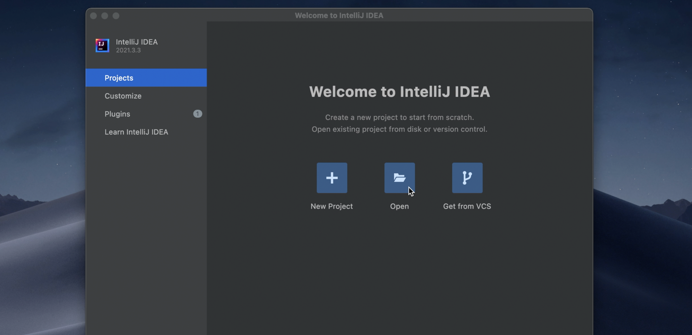
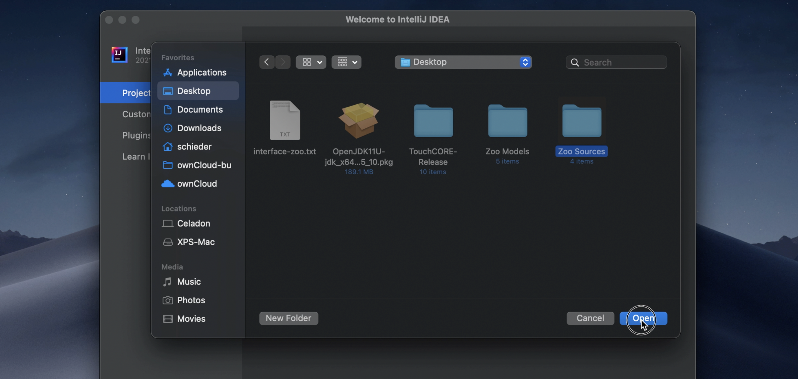
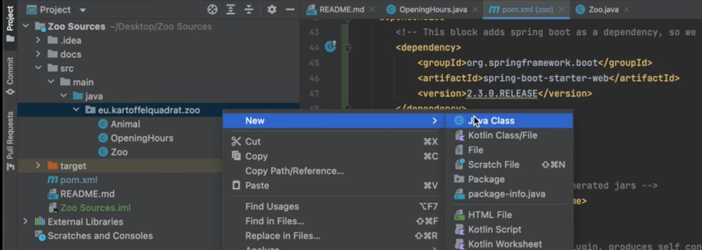
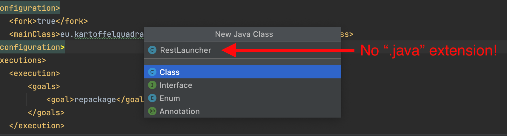
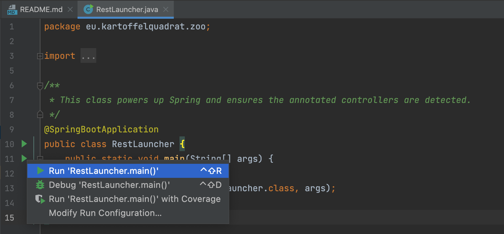
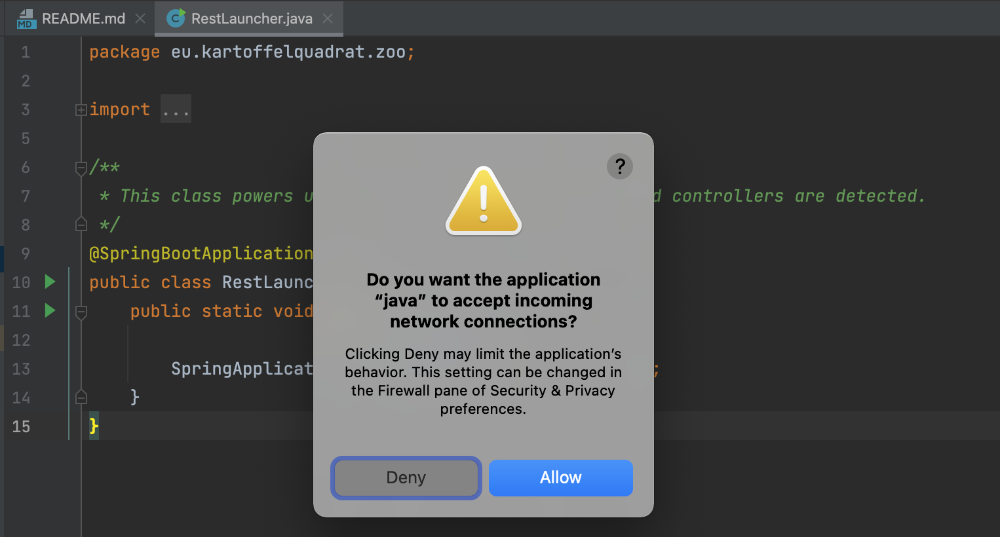

I will now illustrate the steps of a **manual** conversion to a RESTful service on the example of the Zoo.  
I will use the previously shown [Zoo REST interface description](interface-zoo.txt).

 * Please watch [this short screencast](https://www.cs.mcgill.ca/~mschie3/restifyvideos/IntelliJ-1080p.mp4) where I demonstrate and explain the required code changes.
    * Below you find a recapitulation of the main steps.
    * If anything does not work as expected, take a look at the [Troubleshoot section](#troubleshoot).
 * Additionally you can conveniently inspect both versions and the changes made:
    * Switch to *Desktop Zoo* version: ```git checkout master``` or [inspect code online](https://github.com/kartoffelquadrat/Zoo/tree/master/src/main/java/eu/kartoffelquadrat/zoo).
    * Switch to *RESTified Zoo* version: ```git checkout RESTified``` or [inspect code online](https://github.com/kartoffelquadrat/Zoo/tree/RESTified/src/main/java/eu/kartoffelquadrat/zoo).
    * Compare versions: ```git diff master..RESTified``` or [inspect changes online](https://github.com/kartoffelquadrat/Zoo/commit/8fe7675b65f795897910358ed089ea2a0e22aeff).


### Project Layout Overview

A manual RESTification is a series of five activites:

 * [Loading of legacy sources into Integrated Development Environment (IntelliJ IDE)](#loading-legacy-sources-into-ide)
 * [Adjustment of the build configuration file: ```pom.xml```](#build-configuration-changes)
 * [Replacement of the launcher class](#launcher)
 * [Removal of singleton pattern or creation of proxy controllers](#beans-and-singletons)
 * [Decoration of REST controllers and target functions with Spring annotations](#resource-mapping-with-annotations)

### Loading Legacy Sources into IDE

 * Start IntelliJ
 * Use the "*Open*" option to get to the selection dialogue

 * Select the cloned project root folder, then click the "*Open*" button:  


### Build Configuration Changes

 > Want to see all Zoo-RESTify ```pom.xml``` changes at a glance? Run ```git diff master..RESTified pom.xml```. Green lines were added for RESTification, red lines were removed.

 * Artifact properties:
    * Adjust ```artifactId```. Change suffix to "restified"
    * Adjust ```name```. Change suffix to "restified"
 * Update developer information:
    * Remove email, organization
    * Change name **to your personal codename**, e.g. ```blue snail``` (see my email)
    * Change organization to your university: ```mcgill.ca```
 * Parent:
    * Declare inheritance from spring boot parent.  
Place below snippet right *after* the ```<license>...</license>``` block:    
```xml
<!-- this parent block lets this maven project extend a prepared spring specific template.-->
<parent>
  <groupId>org.springframework.boot</groupId>
  <artifactId>spring-boot-starter-parent</artifactId>
  <version>2.3.0.RELEASE</version>
</parent>
```
 * Dependencies:
    * Declare dependency towards spring boot artifact:  
```xml
<!-- This block adds spring boot as a dependency, so we can use the parent pom configuration and non-standard annotations.-->
<dependency>
  <groupId>org.springframework.boot</groupId>
  <artifactId>spring-boot-starter-web</artifactId>
  <version>2.3.0.RELEASE</version>
</dependency>
```
 * Final Name
    * **Add** "restified" to ```finalName``` attribute value
 * Build plugins:
    * **Remove** plugin for legacy launcher class:  
```xml
<!-- specify main class for exec goal -->
<plugin>
  <groupId>org.codehaus.mojo</groupId>
  <artifactId>exec-maven-plugin</artifactId>
  <version>1.6.0</version>
  <executions>
    <execution>
      <goals>
        <goal>java</goal>
      </goals>
    </execution>
  </executions>
  <configuration>
    <mainClass>eu.kartoffelquadrat.zoo.DesktopLauncher</mainClass>
  </configuration>
</plugin>
```
    * **Remove** plugin for legacy compilation to self contained JAR:  
```xml  
<!-- specify main class for JAR manifest-->
<plugin>
  <groupId>org.apache.maven.plugins</groupId>
  <artifactId>maven-jar-plugin</artifactId>
  <version>3.2.0</version>
  <configuration>
    <archive>
      <manifest>
        <mainClass>eu.kartoffelquadrat.zoo.DesktopLauncher</mainClass>
      </manifest>
    </archive>
  </configuration>
</plugin>
```
    * **Add** plugin for spring-boot launcher class: (Don't create the new launcher class yet!)  
```xml  
<!-- Spring specific build plugin, produces self contained JAR with default launcher class.-->
<plugin>
  <groupId>org.springframework.boot</groupId>
  <artifactId>spring-boot-maven-plugin</artifactId>
  <configuration>
    <fork>true</fork>
    <!-- Replace "zoo" by actual package name in next line! -->
    <mainClass>eu.kartoffelquadrat.zoo.RestLauncher</mainClass>
  </configuration>
  <executions>
    <execution>
      <goals>
        <goal>repackage</goal>
      </goals>
    </execution>
  </executions>
</plugin>
```


### Java Code Changes

 > **Hint**: You can use ```git``` to see all ```java``` changes made to the Zoo for manual RESTification.  
Run: ```git diff master..RESTified *java```  
Green lines were added for RESTification, red lines were removed.

#### Remove conflicting files

You have to delete two things:

 * The legacy launcher, located in ```src/main/java/eu/karotffelquadrat/*/DesktopLauncher.java```
 * The legacy unit tests. Remove the entire test folder: ```src/test```  
(This part has been skipped in the Zoo explanatory video, since there were no test classes)

#### Launcher

First thing to do is the creation of a new launcher class. It should be placed anywhere within the ```src/main/java/eu/kartoffelquadrat/...``` directory. 

 * Create it by right clicking on the ```eu.kartoffelquadrat...``` package:  


 * Enter ```RestLauncher``` as class name, **do not** type the ```.java``` extension. IntelliJ will handle that for you.  


Code of the ```RestLauncher.java``` class. (Replaces the legacy launcher)

```java linenums="1"
package eu.kartoffelquadrat.zoo;  <----- Replace "zoo" by whatever application you are working on

import org.springframework.boot.SpringApplication;
import org.springframework.boot.autoconfigure.SpringBootApplication;

/**
 * This class powers up Spring and ensures the annotated controllers are detected.
 */
@SpringBootApplication
public class RestLauncher {
    public static void main(String[] args) {

        SpringApplication.run(RestLauncher.class, args);
    }
}
```

#### Beans and Singletons

 * Spring creates new instances of classes annotated with:  
```java
@RestController
```
 * The existing singleton pattern is bypassed, since Spring uses reflection to gain constructor access, even if the declared constructor is private.
 * Having both ```@RestController``` and a ```getInstance``` method in the same class is dangerous.  
There are two ways to side-step inconsistency issues:
    * **Option 1:** (Recommended) Remove the singleton pattern and replace all invocations of ```getInstance``` by ```@Autowired```.  
Example:
```java linenums="1"
package eu.kartoffelquadrat.zoo;

import org.springframework.beans.factory.annotation.Autowired;
import org.springframework.web.bind.annotation.RestController;

@RestController
public class FooController {

/*
@Autowired ensures the zoo field is set at instantiation of FooController, given Zoo is annotated with @RestController.
*/
    @Autowired
    Zoo zoo;

    public void bar() {
	// Here you can access the zoo instance using the local, autowired field (instead of calling the obsolete getInstance method)
        zoo.getOpeningHours();
    }
}
```
    * **Option 2:** Keep the singleton pattern / leave the original java class untouched. Instead place the ```@RestController``` annotation in a newly created proxy class.  
Example:  
```java linenums="1"
package eu.kartoffelquadrat.zoo;

import org.springframework.web.bind.annotation.RestController;

/**
This Proxy class is decorated with @RestController, instead of the original singleton class. Any required method of the original class can be proxied with an internal getInstance call.
*/
@RestController
public class ZooController {

    /** Proxied access to a method of the original / singleton class.
    public OpeningHours getOpeningHours() {
        // Access to the original class is achieved with a call to getInstance.
        return Zoo.getInstance().getOpeningHours();
    }
}

```

#### Resource Mapping with Annotations

 > Note: Below annotation syntax can only be used in classes annotated with ```@RestController```.

 * Resource mappings (these annotations decorate functions)
     * Annotations types:  

    | Get | Put | Post | Delete |
    |---|---|---|---|
    | ```@GetMapping("...")``` |  ```@PutMapping("...")``` | ```@PostMapping("...")``` | ```@DeleteMapping("...")``` |

     * Arguments:
        * Static: Full resource path within quotes, e.g.: ```"zoo/animals"```
        * Dynamic: Full resource path within quotes. Any dynamic placeholder on path is marked *by curly brackets*, e.g.:```"zoo/animals/{animalname}"```

 * Parameter mapping (these annotations decorate function parameters)
     * Pathvariable:  
```@PathVariable("animalname")```
     * Request body:  
```@RequestBody```

### Build and Run

These instructions are to build and run from command line. While developing in IntelliJ you can safly use the "green triangle button" next to your new spring launcher class.  


The first time you start your REST application you might see a warning about incoming connections. Select "*Allow*".
  

At some point you also need to build your application into a self contained artifact:  

=== "Mac OS / Linux"
     * Build a self contained executable jar file: ```mvn clean package```
     * Run the jar file: ```java -jar target/zoorestified.jar```
     > ```zoorestified``` is the name you provided as ```finalName``` in your ```pom.xml```.

=== "Windows"
     * Build a self contained executable jar file: ```mvn clean package```
     * Run the jar file: ```java -jar target\zoorestified.jar```
     > ```zoorestified``` is the name you provided as ```finalName``` in your ```pom.xml```.


