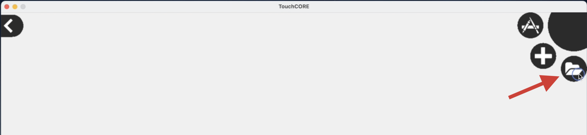
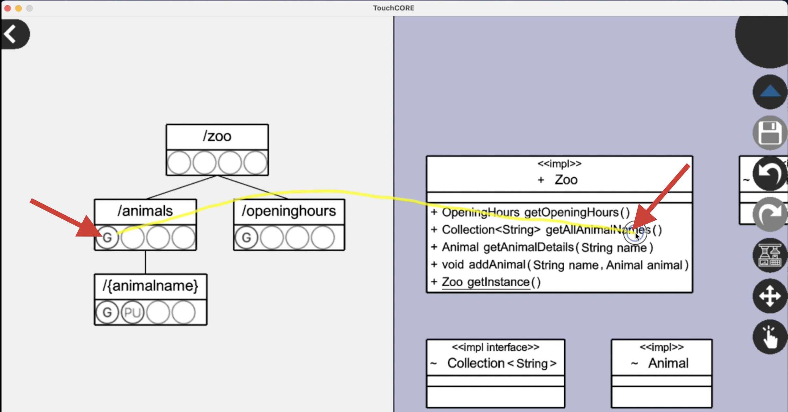

I will now illustrate the steps of a **TouchCORE assisted** conversion to a RESTful service on the example of the Zoo.  
I will use the previously shown [Zoo REST interface description](interface-zoo.txt).

 * Please watch [this short screencast](https://www.cs.mcgill.ca/~mschie3/restifyvideos/TouchCORE-1080p.mp4) where I demonstrate and explain TouchCORE usage.
 * Below you additionally find a recapitulation of the main steps.

### Load TouchCORE Project

 * Locate the TouchCORE release folder
 * Launch TouchCORE: ```java -jar TouchCORE.jar```
 * Load the prepared Zoo model:
    * Click the *folder* icon.  

 * Navigate to the provided *Class Diagram*
    * Tap and hold the "Zoo" box  

    * Select "*Open Realization Model*"
    * Inspect the *Class Diagram* (Business Logic)  


### Draw ResTL Model

 * Use the Navigation bar to leave the *Class Diagram*  

 * Open the "ResTL" perspective:
    * Tap and hold the "Zoo" box  

    * Select "*Open Realization Model*"
    * Open the "Exposed Interface" model
 * Modify the *ResTL* model according to the provided *Interface Description*
    * Drag down to add new resources to the tree (start dragging *slightly* under an existing box)  

    * Click the circles to enable *Get / Put / Post / Delete* methods for a resource.  

 * If you made a mistake, either
    * tap and hold on a resource to remove it
    * double click a resource to rename it

### Resource and Parameter Mapping

 * While in the ResTL perspective, additionally open the *Class Diagram* perspective in split-view mode.
    * Click the *Split-View Button* 

    * Select the *Class Diagram* model
 * Drag lines to establish mappings
    * Connect *Resource Methods* (circles) to *Class Operations*

    * Connect *Dynamic Resources* (text in boxes) to *Operation Parameters*  


 > **Heads-up**: A correctly mapped model showcases lines of both colours, *blue* and *green*! If you only see one colour you may have forgotten parameter mappings.

### Code Generation

 * Make sure the original application is registered in your system:
    * Clone the sources of the original (unrestified) java application
    * Install it as library, with ```mvn clean install```
 * Generate the RESTified code with the *Transformator* button  


### Build and Run your REST service

 * Navigate to your TouchCORE model directory
 * Open a terminal in the new *generated sources* folder
 * Run the RESTful service with: ```mvn clean package spring-boot:run```
 * Test any *Get* operation with your browser, e.g.:  
[```http://127.0.0.1:8080/zoo/animals```](http://127.0.0.1:8080/)
